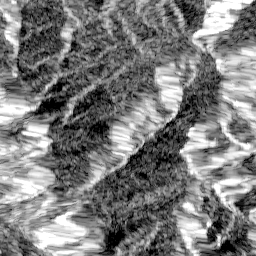
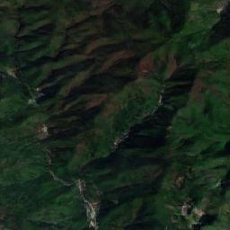

# INR-ECGAN: Enhanced Conditional GAN with Implicit Neural Representation for SAR-to-Optical Image Translation

## Overview
This project implements **INR-ECGAN**, an advanced Conditional Generative Adversarial Network (Conditional GAN) enhanced with Implicit Neural Representation (INR). It is specifically designed for the task of translating Synthetic Aperture Radar (SAR) images into optical images. By incorporating implicit neural representations, this method improves the quality and detail preservation of generated images while enhancing the model's generalization capabilities.

If you use this code in your research or development, please refer to the citation information below.

---

## Table of Contents
1. [Environment Setup](#environment-setup)
2. [Dataset Preparation](#dataset-preparation)
3. [Training and Inference](#training-and-inference)
4. [Results](#results)
5. [Dependencies](#dependencies)
6. [Citation](#citation)
7. [Contact Information](#contact-information)

---

## Environment Setup
Before getting started, ensure that your system has the following software and libraries installed:

### Software Requirements
- Python 3.8 or higher
- PyTorch 1.10 or higher
- CUDA Toolkit (choose the appropriate version based on your GPU configuration)
---

## Dataset Preparation
Download the SAR and optical image datasets and place them in the designated directory. For example:
```
data/
├── trainA/
│   ├── image1.png
│   ├── image2.png
│   └── ...
└── trainB/
│   ├── image1.png
│   ├── image2.png
│   └── ...
├── testA/
│   ├── image1.png
│   ├── image2.png
│   └── ...
└── testB/
    ├── image1.png
    ├── image2.png
    └── ...
```

You can adjust the dataset paths as needed and modify the configuration file accordingly.

---

## Training and Inference

### Training the Model
Run the following command to start training:
```bash
python train.py
```
Training logs and checkpoints will be saved in the `checkpoints/` folder.

### Inference
Use a pre-trained model for inference:
```bash
python test.py
```

---

## Results
Below are some examples of experimental results:

| Input (SAR) | Output (Optical) |
|-------------|------------------|
|  |  |

For more results, please refer to the paper or experiment report.

---

## Dependencies
The main dependencies are listed below:
- PyTorch >= 1.10
- NumPy
- OpenCV
- Matplotlib
- TensorBoard (optional)

For the full list of dependencies, see `requirements.txt`.

---

## Citation
If you use this code in your research or projects, please cite the following paper:

```bibtex
@INPROCEEDINGS{10864577,
  author={Feng, Chenguo and Liu, Yang and Wang, Nan and Chen, Zhiyang and Wei, Xiaohui and Liu, Haibo},
  booktitle={2024 China Automation Congress (CAC)}, 
  title={INR-ECGAN: An Enhanced Conditional GAN with Implicit Neural Representation for SAR-to-Optical Image Translation}, 
  year={2024},
  volume={},
  number={},
  pages={4358-4363},
  keywords={Wavelet transforms;Translation;Optical design;Semantics;Optical distortion;Optical imaging;Feature extraction;Generative adversarial networks;Radar polarimetry;Decoding;SAR-to-Optical image translation;Conditional generative adversarial network;Implicit neural representation},
  doi={10.1109/CAC63892.2024.10864577}}

```

---

## Contact Information
If you have any questions or suggestions, feel free to contact us via the following methods:

- Email: ly758963@hnu.edu.cn

We welcome any issues or pull requests!

---

I hope this README helps you clearly present your project content! If you need further adjustments or additions, let me know.
